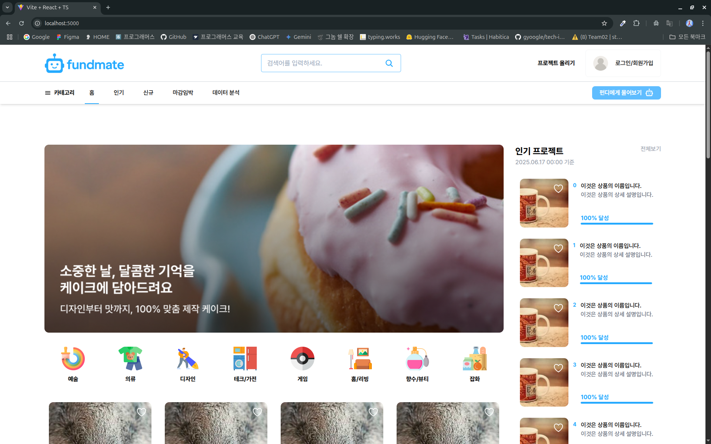
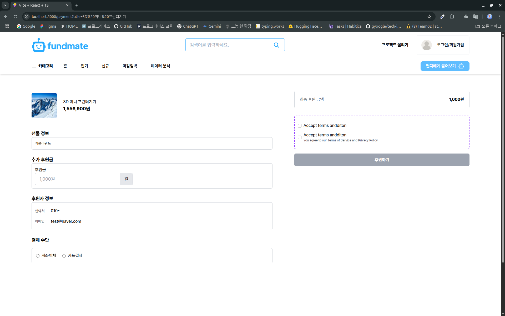
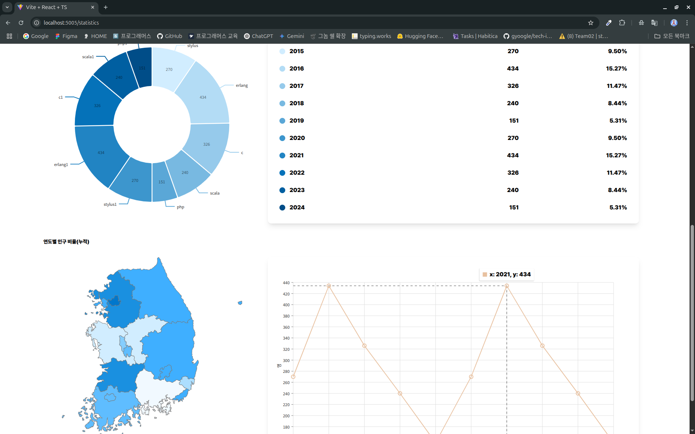

 
 

# 🎯 프로젝트 개요

FUNDMATE는 누구나 쉽게 펀딩을 개설하고 참여할 수 있도록 돕는 **AI 및 공공 데이터 기반 펀딩 플랫폼**입니다.

**MFA(Micro Frontend Architecture)구조**를 도입하여
각 기능을 서비스 단위로 분리해 확장성과 독립성을 높였습니다.

서비스 : <a href="https://www.fundmates.shop/" target="_blank">펀드 메이트 (현재는 서버 종료)</a>

 
 

## 👥 개발 기간 및 팀원

- 개발 기간 : 2025/06 - 2025/07 (1개월)

  |                                          Frontend                                           |                                          Frontend                                          |                                          Frontend                                          |                                          Frontend                                           |
  | :-----------------------------------------------------------------------------------------: | :----------------------------------------------------------------------------------------: | :----------------------------------------------------------------------------------------: | :-----------------------------------------------------------------------------------------: |
  |  |  |  |  |
  |                         [강민경](https://github.com/mingyeong0210)                          |                           [김성윤](https://github.com/tjddbs531)                           |                           [김태진](https://github.com/crossbat)                            |                           [김남빈](https://github.com/kimnambin)                            |
  |                                   펀딩페이지 AI페이지                                    |                                 마이페이지 관리자페이지                                 |                             메인페이지 & 로그인 통계페이지                              |                                         결제페이지                                          |

 
 

## 📜 주요 기능

우리 서비스의 핵심 기능은 2가지입니다.

- 한줄 소개 및 아이디어를 지원받는 **`AI 콘텐츠`**
- **`공공데이터`** 기반 통계 제공

 
 

## 📺 화면 구성

|                  메인 페이지                   |
| :--------------------------------------------: |
|  |

|                  결제 페이지                   |
| :--------------------------------------------: |
|  |

|                  통계 페이지                   |
| :--------------------------------------------: |
|  |

 
 

## 🔬 기술 스택

| 기술 스택                      | 설명                                                                         | 로고                                                                                                                        |
| ------------------------------ | ---------------------------------------------------------------------------- | --------------------------------------------------------------------------------------------------------------------------- |
| **React**                      | 컴포넌트 기반 재사용성과 유지보수가 좋은 라이브러리 도구                     |                    |
| **Tailwind-styled-components** | Tailwind의 빠른 스타일링과 Styled-components의 컴포넌트 구조화를 동시에 사용 |  |
| **TypeScript**                 | JavaScript에 정적 타입을 추가하여 사전 오류 방지                             |      |
| **Zustand**                    | 전역 상태 관리를 위한 간단하고 빠른 상태 관리 라이브러리                     |               |
| **Jest**                       | 빠르고 직관적인 테스트 환경 제공                                             |                        |
| **Mock Service Worker**        | 외부 API 없이 응답 테스트                                                    |                          |

 

## 시연 영상

메인 페이지

<video width="640" height="360" controls>

  <source src="./video/메인페이지.mp4" type="video/mp4">
</video>

AI 활용 + 통계

<video width="640" height="360" controls>

  <source src="./video/펀디에게물어봐.mp4" type="video/mp4">
</video>

결제 페이지

<video width="640" height="360" controls>
  <source src="./video/결제페이지.mp4" type="video/mp4">
</video>
