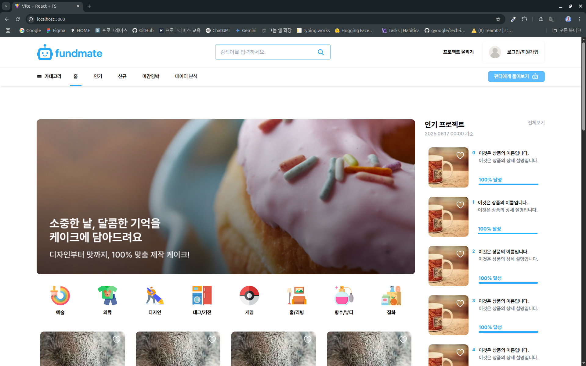
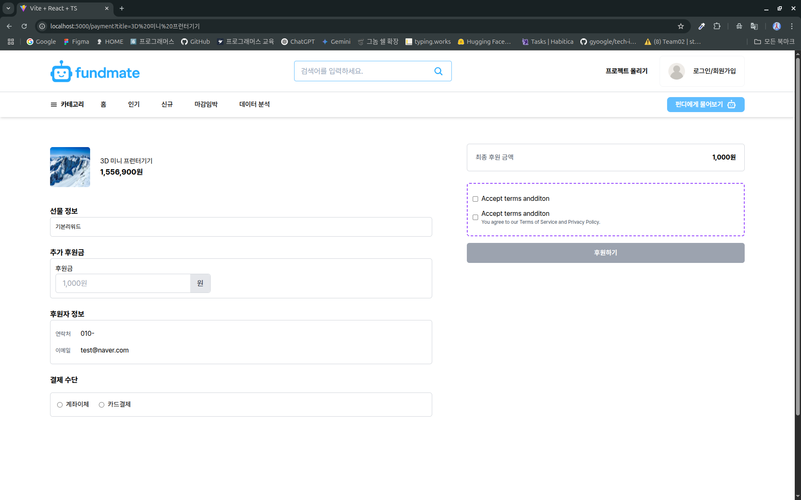
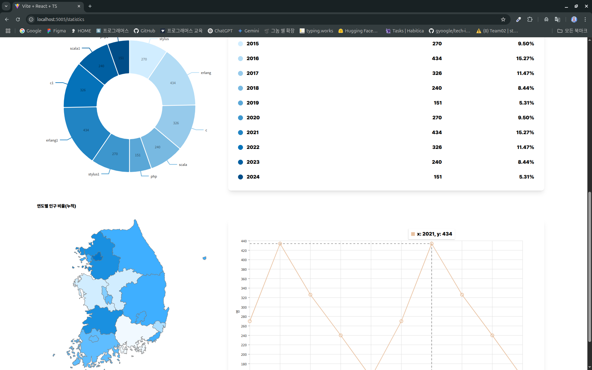

<div align="center">


</div>

<br/>
<br/>

# 🎯 프로젝트 개요

FUNDMATE는 누구나 쉽게 펀딩을 개설하고 참여할 수 있도록 돕는 **AI 및 공공 데이터 기반 펀딩 플랫폼**입니다.

**MFA(Micro Frontend Architecture)** 구조를 도입하여
각 기능을 서비스 단위로 분리해 확장성과 독립성을 높였습니다.

서비스 : <a href="https://www.fundmates.shop/" target="_blank">펀드 메이트 (현재는 서버 종료)</a>

<br/>
<br/>

## 🏗️ MFA 아키텍처 설계

### 왜 MFA(Micro Frontend Architecture)를 선택했나요?

본 프로젝트는 `결제`, `펀딩`, `관리자`, `메인` 등 도메인이 명확히 분리되어 있어, 각 팀원이 독립적으로 개발·배포할 수 있는 구조가 필요했습니다.

| 기존 모놀리식 | MFA (이 프로젝트) |
|---|---|
| 코드 변경 시 전체 재빌드 | 변경된 앱만 독립 빌드·배포 |
| 팀원 간 코드 충돌 빈번 | 앱 단위로 분리되어 충돌 최소화 |
| 런타임 에러가 전체 서비스에 영향 | 앱 단위 격리로 장애 영향 범위 축소 |

### 구조

```
fundmate-fe/
├── apps/
│   ├── main/       # Host 앱 — 다른 앱을 조합하는 Shell
│   ├── funding/    # 펀딩 생성 Remote App
│   ├── payment/    # 결제 Remote App  ← 김남빈 담당
│   ├── admin/      # 관리자 Remote App
│   └── mypage/     # 마이페이지 Remote App
└── packages/
    └── ui/         # 공유 컴포넌트 라이브러리 (모든 앱이 공유)
```

**Module Federation (Vite Plugin Federation)** 을 사용해 런타임에 각 Remote App을 동적으로 로드합니다.  
`packages/ui`는 공통 컴포넌트(버튼, 모달, 카드 등)를 Shared Module로 모든 앱이 재사용합니다.

<br/>

## 👤 김남빈의 기여 (payment 앱)

### 담당 범위: `apps/payment`

결제 플로우 전체를 단독으로 설계·구현했습니다.

| 영역 | 내용 |
|---|---|
| **페이지** | 상품 상세(`ProductPage`), 결제(`PaymentPage`), 결제 완료(`PaymentcompletedPage`), 결제 내역(`PaymentDetail`) |
| **결제 수단** | 신용카드(`CardPaymentModal`) · 계좌이체(`TransferModal`) 폼 구현 |
| **폼 검증** | `react-hook-form` 기반 실시간 유효성 검사 (카드번호 4자리 분리, CVC, 만료일, 계좌번호 정규식) |
| **상태 관리** | `Zustand`로 결제 정보 전역 관리 (`mockPaymentStore`, `useSavepaymentStore`) |
| **API 레이어** | `@tanstack/react-query` Mutation으로 결제 예약·조회·취소·수정 훅 분리 |
| **모킹 전략** | MSW(Mock Service Worker)로 백엔드 없이 개발·테스트 가능하도록 구성 |
| **보안 유틸** | 카드번호 마스킹 (`coverSec`: 앞 3자리 노출, 나머지 `*` 처리) |
| **테스트** | Jest + Testing Library로 유틸 함수(날짜, 숫자 포맷, 보안) 단위 테스트 작성 |
| **반응형** | `useIsMobile` 훅으로 모바일/데스크탑 레이아웃 분기 |

<br/>
<br/>

## 👥 개발 기간 및 팀원

- 개발 기간 : 2025/06 - 2025/07 (1개월)

  |                                          Frontend                                           |                                          Frontend                                          |                                          Frontend                                          |                                          Frontend                                           |
  | :-----------------------------------------------------------------------------------------: | :----------------------------------------------------------------------------------------: | :----------------------------------------------------------------------------------------: | :-----------------------------------------------------------------------------------------: |
  |  |  |  |  |
  |                         [강민경](https://github.com/mingyeong0210)                          |                           [김성윤](https://github.com/tjddbs531)                           |                           [김태진](https://github.com/crossbat)                            |                           [김남빈](https://github.com/kimnambin)                            |
  |                                   펀딩페이지<br>AI페이지                                    |                                 마이페이지<br>관리자페이지                                 |                             메인페이지 & 로그인<br>통계페이지                              |                                         결제페이지                                          |

<br/>
<br/>

## 📜 주요 기능

우리 서비스의 핵심 기능은 2가지입니다.

- 한줄 소개 및 아이디어를 지원받는 **`AI 콘텐츠`**
- **`공공데이터`** 기반 통계 제공

<br/>
<br/>

## 📺 화면 구성

|                  메인 페이지                   |
| :--------------------------------------------: |
|  |

|                  결제 페이지                   |
| :--------------------------------------------: |
|  |

|                  통계 페이지                   |
| :--------------------------------------------: |
|  |

<br/>
<br/>

## 🔬 기술 스택

| 기술 스택                      | 설명                                                                         | 로고                                                                                                                        |
| ------------------------------ | ---------------------------------------------------------------------------- | --------------------------------------------------------------------------------------------------------------------------- |
| **React**                      | 컴포넌트 기반 재사용성과 유지보수가 좋은 라이브러리 도구                     |                    |
| **Tailwind-styled-components** | Tailwind의 빠른 스타일링과 Styled-components의 컴포넌트 구조화를 동시에 사용 |  |
| **TypeScript**                 | JavaScript에 정적 타입을 추가하여 사전 오류 방지                             |      |
| **Zustand**                    | 전역 상태 관리를 위한 간단하고 빠른 상태 관리 라이브러리                     |               |
| **Vite Plugin Federation**     | MFA 구현을 위한 Module Federation (Remote App 런타임 로드)                   |                       |
| **TanStack Query**             | 서버 상태 관리 및 API Mutation (결제 예약·조회·취소)                         |   |
| **Jest**                       | 빠르고 직관적인 테스트 환경 제공                                             |                        |
| **Mock Service Worker**        | 외부 API 없이 응답 테스트 가능                                               |                          |

<br/>

## 시연 영상

메인 페이지


<br/>

AI 활용 + 통계


<br/>

결제 페이지

